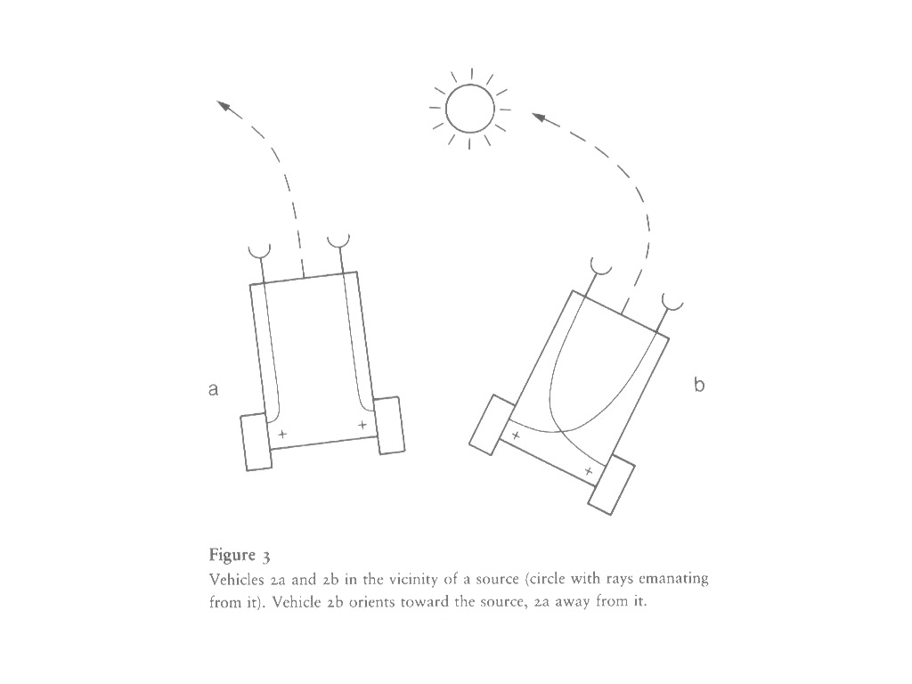
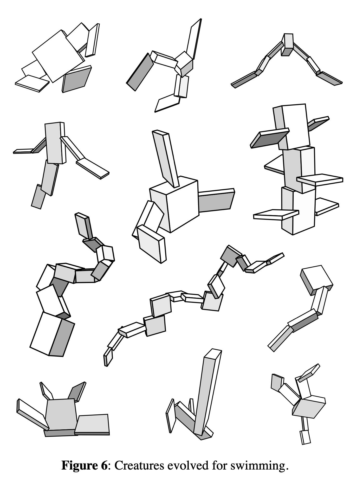
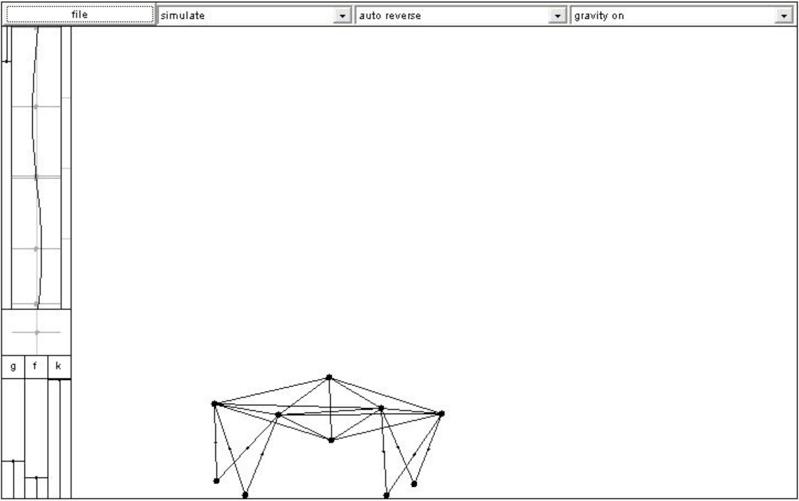
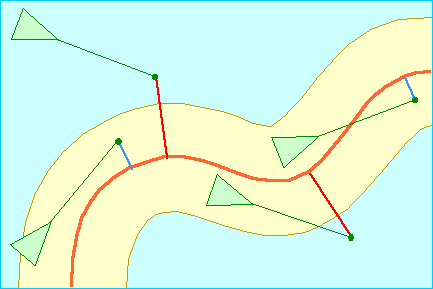

# microexcursion / agents + virtual physics

---

## some inspirations

---

### Valentino Braitenberg: Vehicles, Experiments in Synthetic Psychology

- [book](https://web.archive.org/web/20100129022037/http://mitpress.mit.edu/catalog/item/default.asp?ttype=2&tid=3323)
- [Braitenberg Vehicle](https://en.wikipedia.org/wiki/Braitenberg_vehicle) @ wikipedia

---

### Karl Sims: Evolved Virtual Creatures, 1994 

[video](https://youtu.be/RZtZia4ZkX8)

---

### Ed Burton: Soda Constructor, 2000

[Soda Constructor](https://en.wikipedia.org/wiki/Soda_Constructor) @wikipedia

---

### Craig Reynolds: Boids + Steering Behaviors

- [Craig Reynolds: Boids](http://www.red3d.com/cwr/boids/) + [Research Paper](https://www.cs.toronto.edu/~dt/siggraph97-course/cwr87/)
- [Craig Reynolds: Steering Behaviors](http://www.red3d.com/cwr/steer/)
- [OpenSteer](http://opensteer.sourceforge.net)

---

## virtual physics libraries ( or engines )

---

### well-known physics engines

- [Open Dynamics Engine](http://www.ode.org) @C/C++ "ODE is an open source, high performance library for simulating rigid body dynamics."
- [Bullet](https://github.com/bulletphysics/bullet3) @C++ "Bullet Physics SDK: real-time collision detection and multi-physics simulation for VR, games, visual effects, robotics, machine learning etc."
- [PhysX](https://developer.nvidia.com/gameworks-physx-overview) "PhysX is a scalable multi-platform game physics solution supporting a wide range of devices, from smartphones to high-end multicore CPUs and GPUs. PhysX is already integrated into some of the most popular game engines, including Unreal Engine (versions 3 and 4), Unity3D, and Stingray."
- [Havok Physics](https://www.havok.com/havok-physics/) @C++ @unity "Havok Physics offers the fastest, most robust collision detection and physical simulation technology available, which is why it has become the gold standard within the games industry and has been used by more than half of the top selling titles this console generation."
- [Box2D](https://box2d.org) @C++ "A 2D Physics Engine for Games" + [Box2D for Processing](https://github.com/shiffman/Box2D-for-Processing) @library

---

### teilchen

"teilchen is a simple physics library based on particles, forces, constraints and behaviors."

[teilchen.zip](material/teilchen.zip) or on github [teilchen](https://github.com/d3p/teilchen) @library @processing

see example folder

---

### agents

see `./material/Agents`

- *Autonomous Agents* or sometimes *vehicles*
- related to particles
- related to behaviors

---

## further readings + references

- [Daniel Shiffman: The Nature of Code](https://natureofcode.com) @examples
- [Algorithmic Cliches](https://github.com/d3p/algorithmic-cliches) @library
