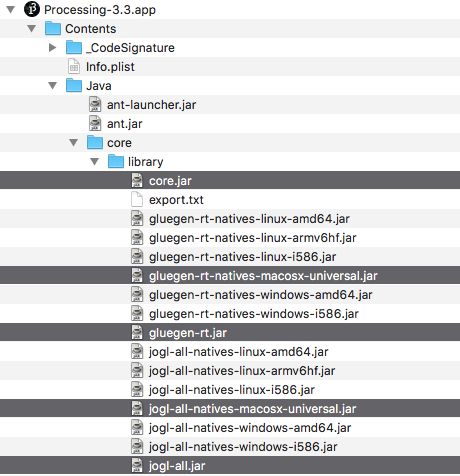

# microexcursion / processing+IDEs

---

## Processing.org with IDEs

### a few words on the benefits using an Integrated Development Environment ( IDE )

- the choice for an IDE is *always* a very personal decision 
- the following IDEs are @recommendations(dpp) and are all *for free* ( at least for academic use ):
    - [IntelliJ](https://www.jetbrains.com/idea/) -- focus on java, many nice features, free via academic license @personal_preference(#1)
    - [Visual Studio Code](https://code.visualstudio.com/) + [Processing Language](https://marketplace.visualstudio.com/items?itemName=Tobiah.language-pde) Plugin -- extremly flexible and versatile IDE extendible through plugins @personal_preference(#2) 
- and to a certain extends also the following:
    - [Eclipse](https://eclipse.org) -- very broad focus, quite huge feature set, huge community
    - Atom -- very broad focus, highly customizable
    - Sublime -- very versatile, not all *Java IDE* available, takes some effort to setup properly
    - [NetBeans](https://netbeans.org) -- focus on java, rather slim IDE
- make sure java is installed. e.g [Java SDK](http://www.oracle.com/technetwork/java/javase/downloads/jdk8-downloads-2133151.html)

---

### skeleton code for processing.org sketches

``` processing
    package de.vendorname.projectname;
    
    import processing.core.PApplet;
    
    public class SketchSkeleton extends PApplet {    

        public void settings() {
            size(640, 480);
        }
    
        public void setup() {
        }
    
        public void draw() {
        }
    
        public void keyPressed() {
        }
            
        public static void main(String[] args) {
            PApplet.main(SketchNetworkBeat.class.getName());
        }
    }
```

### linking libraries



- `core.jar` + `gluegen-rt.jar` + `jogl-all.jar` usually located at `/Applications/Processing.app/Contents/Java/core/library`
- external libraries

### @maybe starting java from the command-line ( on MacOS )

to run a sketch ( e.g `Perspective` ) from the command-line the following steps could be taken:

1. export sketch as applicaiton from processing
2. navigate into the application package into the java folder `./Perspective/application.macosx/Perspective.app/Contents/Java`
3. execute the `java` application by correctly setting the *classpath* ( all *.jar* files ) and pointing it to the main class ( `Perspective` ):

the following two commands are likely to work if terminal is navigated to the folder containing the exported application ( `Perspective.app` ) :

    
    $ cd ./Perspective/application.macosx/Perspective.app/Contents/Java
    $ java -classpath Perspective.jar:core.jar:jogl-all.jar:jogl-all-natives-macosx-universal.jar:gluegen-rt.jar:gluegen-rt-natives-macosx-universal.jar Perspective
    
